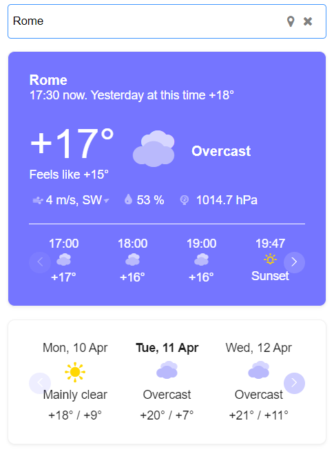

### Description

Weather forecast application. [Live demo](https://a413x.github.io/weather-app/).

Made with React, Redux, Typescript.

### Project setup

In the project directory, you can run:

### `npm install`

## Available Scripts

In the project directory, you can run:

### `npm start`

Runs the app in the development mode.

### `npm test`

Launches the test runner in the interactive watch mode.

### `npm run build`

Builds the app for production to the `build` folder.

### `npm run eject`

If you aren't satisfied with the build tool and configuration choices, you can `eject` at any time. This command will remove the single build dependency from your project.
